# セットアップ手順書（Gemini APIキーの取得）

  
「YouTube映像AI要約」を使うには、**Gemini API** の**APIキー**というものが必要です。APIキーというのは、この拡張機能から生成AIの機能を利用するために必要な情報です。このAPIキーを取得するためには、Googleアカウント（無料で作成できます）が必要となりますので、事前にご取得いただきますようお願いいたします。

本ページでは**APIキー**を取得するために**Google AI Studio**というものにアクセスする必要がありますが、Google AI Studioを使ったことがない方でもつまずかないよう、APIキーの取得から拡張機能への登録までを順番に説明します。
  

## 手順

  

### 1. Google AI StudioでAPIキーを作成する

1. [Google AI Studio](https://aistudio.google.com/) を開き、**［Get started］**をクリックする

2. ご利用いただくGoogleアカウントでログインする（求められた場合）

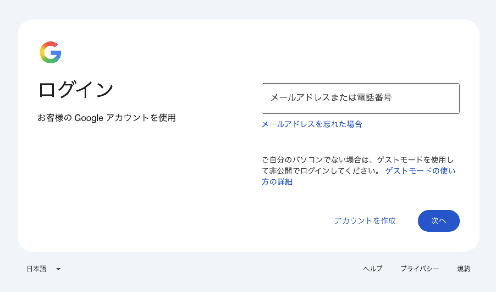

3. Google AI Studioに最初にアクセスすると、ようこそのダイアログが表示されます。利用規約やプライバシーポリシーを確認し、チェックを入れた後、**［続行］**を押下します。

4. 画面左ペインの**［Dashboard］**をクリックします。

5. 画面右上の**［APIキーを作成］**をクリックします。

6. ダイアログが表示されたら、**［キー名の設定］**のラベルに適当な文字列（"YouTube Movie AI Summary"など）を入力します。その後、**［キーを作成］**を押下します。

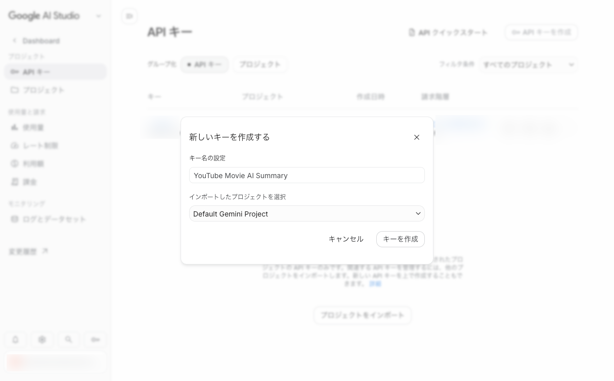

7. 数秒でキーが発行されるので、表示された**［API キー］**の文字列をコピーしてください。文字列の右側にあるコピーボタンをクリックすると便利です。

### 2. 拡張機能にAPIキーを登録する

  
1. YouTubeの動画ページ（`https://www.youtube.com/watch?v=...`）を開きます。拡張機能がインストールされていると、画面右下に**［🔎簡単に要約］**と**［⋮］**のボタンが確認できます。画面右下の **［⋮］**ボタンを押下します。

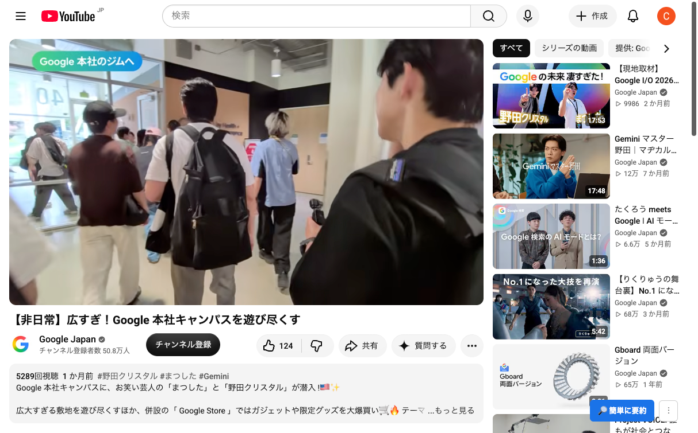

2. メニューから **［⚙ 設定］** を選ぶ

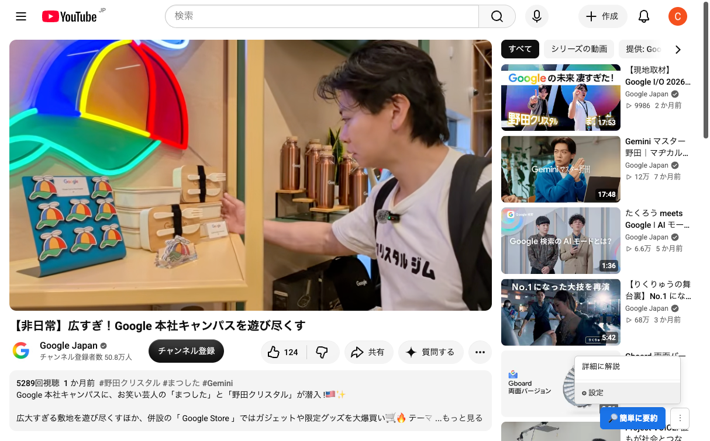

3. **［APIキー］**欄の **［変更］** ボタンを押す

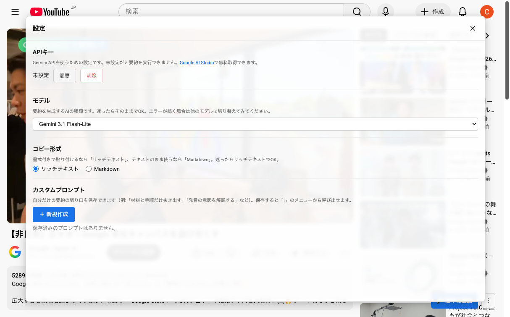

4. APIキーの入力を求められます。セットアップの手順でコピーしたAPIキーを貼り付けて**［OK］**を押下します。

5. 「APIキーを保存しました。」と表示されれば完了です。**［OK］**を押下して、ダイアログを閉じます。

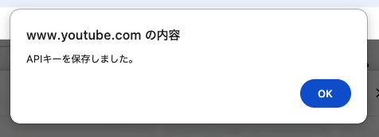

6. APIキーの欄で「設定済み（APIキー）」が表示されているのを確認したら、画面右上の**［✕］**ボタンを押下して、ポップアップを閉じます。

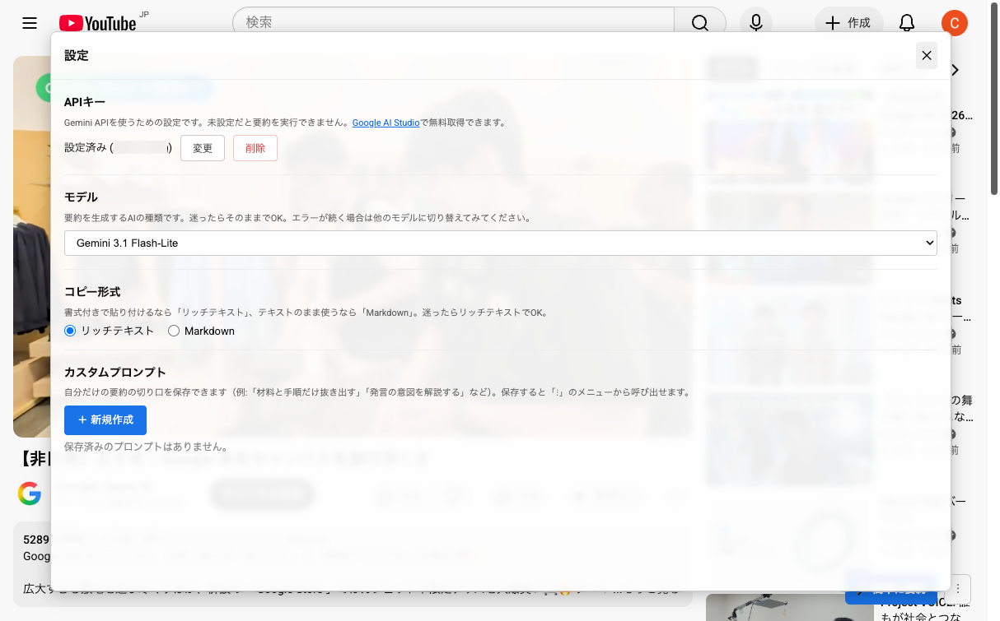

### 3. 要約を試してみる

1. 動画ページで **［🔎 簡単に要約］** ボタンを押下し、生成中となるので、待ちます。

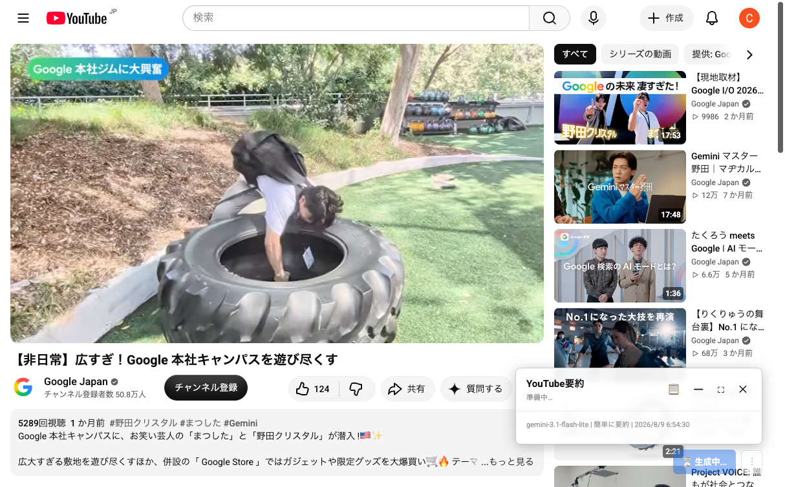

2. しばらく待つと、要約結果がポップアップで表示されます。

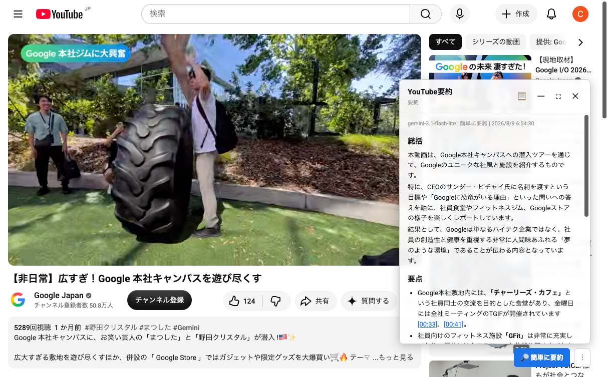

## FAQ

- **「APIキーが未設定です」と表示される** — 手順2でキーの貼り付け・保存ができているか確認してください。「⋮」→「⚙ 設定」の「APIキー」欄が「未設定」のままなら未保存です。

- **APIキーをコピーしそこねてしまった** — [Google AI Studio](https://aistudio.google.com/apikey) の一覧から該当するAPIキーをクリックすることで再表示ができます。

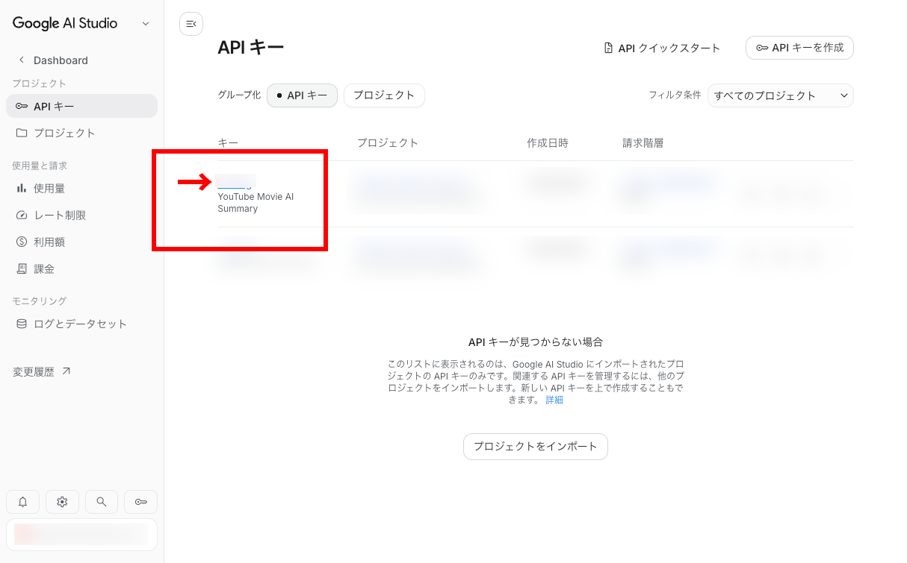

- **APIキーを他人に知られてしまった／作り直したい** — 「⋮」→「⚙ 設定」の「APIキー」欄の「削除」で拡張機能側の登録を消してから、手順1でキーを作り直してください（Google AI Studio側で古いキーを無効化する場合は [Google AI Studio - APIキー](https://aistudio.google.com/apikey) の一覧から削除してください）。

- **要約中にエラーが出る／止まる** — Gemini APIには無料枠がありますが、利用量に応じた制限（レート制限）があります。再試行しても改善されない場合、しばらく待つか、「⚙ 設定」の「モデル」欄で別のモデルに切り替えて試してください。

- **要約の生成にどのぐらい時間がかかるか知りたい** — 動画の長さ・プロンプト・モデルなどによるため、一概にはお伝えできませんが、検証実績では、多くの動画は数十秒、より複雑な状況になると1分程度であることが多いです。もし、過剰に待たされる場合には、何等かのトラブルが生じている可能性がありますので、FAQに記載のエラーの対応をお試しください。

- **レート制限の状況を知りたい** — APIキーに関わる内部情報は、この拡張機能では取得・関与できません。[Google AI Studio - レート制限](https://aistudio.google.com/rate-limit)にアクセスし、ご確認ください。

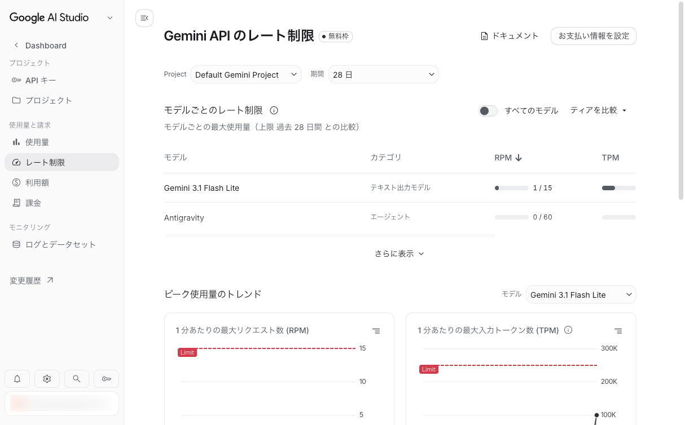

- **この拡張機能やAPIキーは無料か知りたい** — 拡張機能は無料です。APIキーについては利用の上限はありますが無料であることを、本拡張機能の配布時に確認しています。ただし、APIキーについてはGoogleが提供しているものとなりますので、価格や利用上限についての最新情報はGoogleの公式情報を確認いただきますようお願いいたします。

## 機能紹介

### 詳細に解説

［⋮］メニューにある［詳細に解説］ボタンを押下すると、要約だけでなく、動画の一連の流れを解説してくれる表示が可能です。また、ポップアップの右上には、コピーボタンで出力されたテキストをコピー＆ペーストできるようにしたり、最小化ボタンや最大化ボタンで表示サイズを変更することができます。

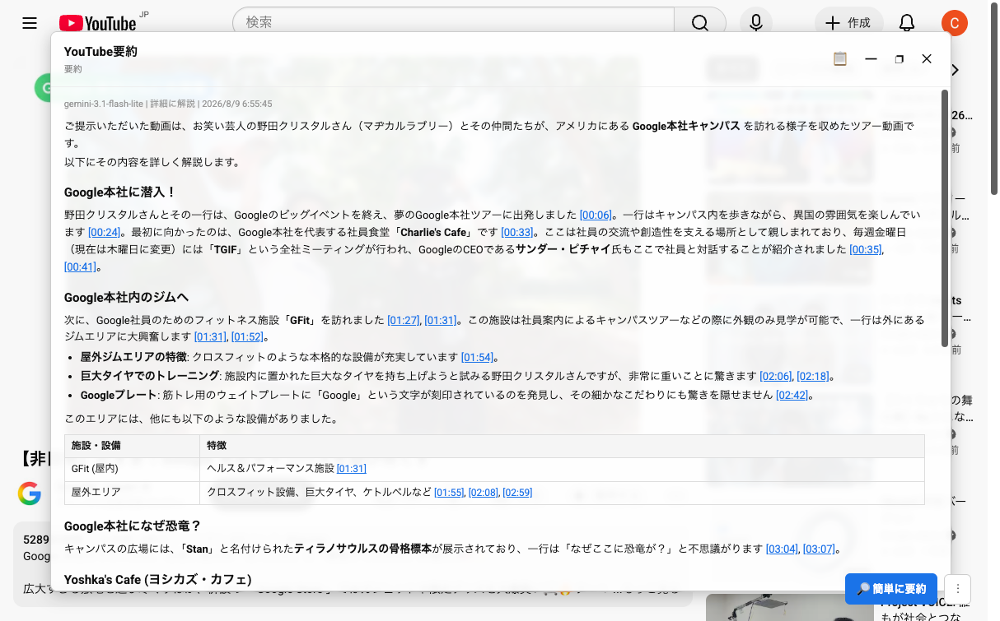

### マルチモーダルAIによる映像の分析

Gemini APIはデフォルトで「マルチモーダル」での分析に対応してます。YouTubeの分析においては、動画中の文字情報（字幕）だけでなく、音声や映像など、複数の異なる種類の情報を統合して同時に理解する仕組みや技術です。

そのため、音楽の演奏映像などにも、以下のような要約や解説が可能になります。実際に表示されている文章にも、演奏や照明について書かれていることが確認できます。

### カスタムプロンプト

デフォルトで用意されている［簡単に要約］［詳細に解説］以外にも、自分好みの動画分析が可能です。例えば、レシピを紹介する動画では、レシピ専用のプロンプトを作成すると、［詳細に解説］の下に自分専用のプロンプトが追加され、材料や工程といった形で解説させることができます。

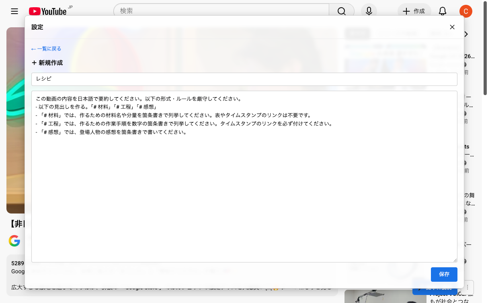

